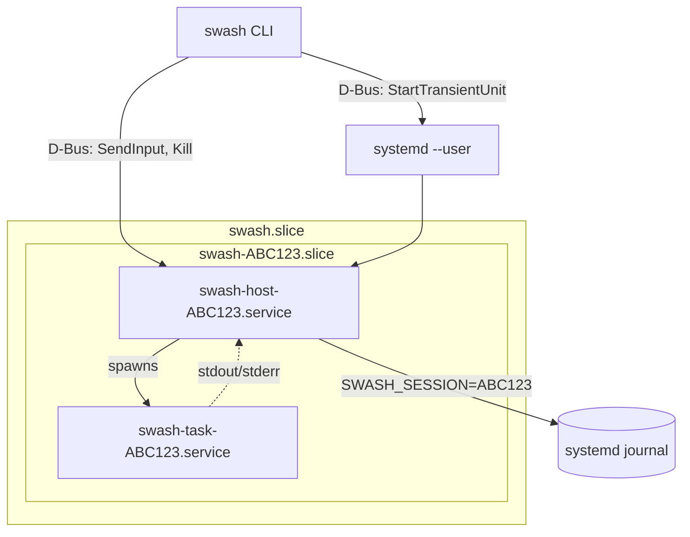

# swash

Persistent process sessions with detach/reattach and structured output logging.

swash runs commands in the background and captures their output to a structured
log. Each session gets a control interface for sending input, killing the
process, and querying status. You can disconnect and reconnect without losing
the session.

Two backends are available:

- **systemd** (default on Linux with D-Bus): Sessions run as systemd transient
  units with D-Bus control and journal-based output. Provides cgroup isolation,
  automatic cleanup, and integration with standard systemd tooling.

- **posix** (portable): Sessions run as background processes with Unix socket
  control and file-based output logging. Works on any POSIX system without
  systemd dependencies.

## Architecture

### systemd backend



When you run `swash run echo hello`, the CLI asks systemd to start a transient
service called `swash-host-ABC123.service`. This host service owns a D-Bus name
(`sh.swa.Swash.ABC123`) and exposes methods for sending input, killing the
process, and querying status. The host then starts another transient unit,
`swash-task-ABC123.service`, which runs the actual command. Both units live
inside `swash-ABC123.slice` for resource grouping.

The host captures stdout and stderr from the task and writes each line to the
systemd journal with `SWASH_SESSION=ABC123`. This means output survives even if
the original client disconnects - you can reconnect later and query the journal
to see what happened.

### posix backend

The posix backend uses the same host process architecture but replaces
systemd-specific components:

- **Control**: Unix domain socket instead of D-Bus
- **Output**: Single shared journal file via `swash minijournald` daemon (native systemd format, readable by `journalctl --file=...`)
- **Process management**: Direct fork/exec with POSIX signals instead of transient units

To use the posix backend explicitly: `SWASH_BACKEND=posix swash run ...`

swash auto-detects by connecting to the D-Bus session bus and checking if
`org.freedesktop.systemd1` is registered. This correctly handles non-systemd
Linux systems that have D-Bus but use a different init system.

## Usage

```bash
swash run echo "hello world"    # run command, show output, wait for exit
swash run -d 10s ./slow-script  # wait up to 10s, then detach if still running
swash run --tty htop            # run interactively with TTY
swash start ./background-job    # start and detach immediately
swash                           # list running sessions
swash follow ABC123             # stream output until exit
swash attach ABC123             # attach to TTY session (Ctrl+\ to detach)
swash send ABC123 "input"       # send to stdin
swash stop ABC123               # graceful stop
swash kill ABC123               # terminate immediately
swash history                   # show past sessions from journal
```

`swash run` executes a command, streams its output, and waits for it to complete
(with a default 3-second timeout). If the command finishes in time, swash exits
with the command's exit code. If the timeout expires, it detaches and prints the
session ID so you can reconnect with `swash follow`.

`swash start` is equivalent to `swash run -d 0` - it starts the session and
returns immediately without waiting.

### TTY Mode

For interactive programs, swash can allocate a pseudo-terminal and emulate a
full terminal using libvterm. This handles colors, cursor movement, alternate
screen mode (used by vim, htop, etc.), and other terminal features correctly.

```bash
swash run --tty htop            # start htop and attach interactively
swash start --tty -- htop       # start in background
swash attach ABC123             # attach to running TTY session
swash screen ABC123             # view current screen snapshot
```

When attached, press `Ctrl+\` to detach without killing the process. You can
reattach later with `swash attach`. Multiple clients can attach to the same
session - they all see the same screen, and the terminal size follows the
smallest attached client.

```bash
swash start --tty --rows 40 --cols 120 -- vim file.txt
```

The `swash screen` command returns a snapshot of the terminal screen with ANSI
color codes preserved. Here's what it looks like with htop:

```
$ swash start --tty --rows 10 --cols 70 -- htop
XYZ789 started

$ swash screen XYZ789
    0[|||  4.6%]   4[||   2.0%]   8[||   3.3%]  12[||   2.0%]
    1[||   2.0%]   5[||   2.6%]   9[||   2.6%]  13[||   1.3%]
  Mem[|||||||||||||||||||||||||||||||||12.5G/62.6G]
  Swp[|                               520M/32.0G]

    PID USER       PRI  NI  VIRT   RES S  CPU% Command
1521271 mbrock      20   0 76.1G 4383M S  39.5 opencode
3814634 mbrock      20   0  855M  110M S   3.3 emacs
F1Help F2Setup F3Search F4Filter F5Tree F6SortBy F9Kill F10Quit
```

In TTY mode, output goes through libvterm before being logged. Lines are
captured as they scroll off the screen, and the final screen state is saved
to the journal when the process exits (as a `SWASH_EVENT=screen` entry).

### Tags and Protocols

You can attach custom metadata to sessions using tags, which become journal
fields:

```bash
swash run -t PROJECT=myapp -t ENV=staging -- ./deploy.sh
```

The `--protocol` flag controls how stdout is parsed. The default `shell`
protocol treats each line as a separate journal entry. The `sse` protocol
parses Server-Sent Events format, extracting the content from `data:` lines.

### Contexts

Contexts group related sessions with a shared working directory. This is useful
for isolating work on different projects or tasks.

```bash
swash context new               # create a new context, prints ID and directory
swash context list              # list all contexts
swash context dir ABC123        # print context directory path
swash context shell ABC123      # enter a shell in the context
```

Inside a context shell, `SWASH_CONTEXT` is set automatically. All `swash run`
and `swash start` commands inherit this, so sessions are grouped together.
The prompt shows the context ID and number of running sessions.

```bash
$ swash context shell ABC123
[swash context ABC123]
~/.local/state/swash/contexts/ABC123$ swash start ./build.sh
XYZ789 started
[swash context ABC123; 1 running]
~/.local/state/swash/contexts/ABC123$ swash
# shows only sessions in this context
```

Use `swash -a` or `swash history -a` to see all sessions regardless of context.

### HTTP API

swash includes an HTTP server for web-based session management:

```bash
swash http                      # run server (default: socket-activated or :8484)
swash http install [port]       # install as systemd socket service
swash http uninstall            # remove systemd units
swash http status               # check service status
```

The server provides a web UI for listing sessions, viewing output, and attaching
to TTY sessions via WebSocket. When installed as a socket service, systemd
starts the server on-demand when connections arrive.

## Components

The CLI (`cmd/swash`) is the main entry point. It talks to systemd over D-Bus
to start sessions and connects to running host services to send input or query
status.

The core library (`internal/`) is split into focused packages. The session host
implementations live in `internal/host` (`Host`, pipe-based I/O) and
`internal/tty` (`TTYHost`, PTY + libvterm). Both expose the same D-Bus surface,
so the CLI doesn't need to know which mode a session is using.

The vterm package (`pkg/vterm`) provides Go bindings to libvterm. It tracks
screen state, handles scrollback callbacks, and can render the screen back to
ANSI escape sequences for the `swash screen` command.

For testing, `swash minijournald` provides a minimal journald daemon for the
posix backend. It implements the native journal socket protocol, using
`pkg/journalfile` to write actual journal files that journalctl can read.
This is built into the main swash binary as a subcommand, so no separate binary
is needed. Integration tests use the posix backend by default, which runs in
isolation without root privileges or a real systemd.

## Building

```bash
# Option 1: Use the build wrapper (sets CGO_CFLAGS automatically)
./build.sh ./cmd/swash/...

# Option 2: Use make
make build

# Option 3: Set CGO_CFLAGS manually
CGO_CFLAGS="-I$(pwd)/cvendor" go build ./cmd/swash/

# Run tests
make test                       # unit + integration tests
make test-unit                  # just unit tests
make test-integration           # integration tests (posix backend by default)
```

You'll need Go 1.24+, a C compiler (for libvterm via cgo). The systemd headers
are vendored in `cvendor/`, so you don't need libsystemd-dev installed - just
make sure to use `./build.sh` or `make` to set the include path correctly.

## Journal Integration (systemd backend)

With the systemd backend, swash writes structured fields to the journal, making
it easy to query session output:

```bash
journalctl --user SWASH_SESSION=ABC123          # all output from a session
journalctl --user SWASH_SESSION=ABC123 -o cat   # just the message text
journalctl --user SWASH_EVENT=exited            # all exit events
```

The `SWASH_SESSION` field identifies the session. `SWASH_EVENT` marks lifecycle
events (`started`, `exited`, `screen`). Regular output lines include `FD` (1 for
stdout, 2 for stderr) and `MESSAGE` (the actual text).

With the posix backend, output goes to a single shared journal file at
`~/.local/state/swash/swash.journal`. This is a native systemd journal file -
you can query it directly with journalctl:

```bash
journalctl --file=~/.local/state/swash/swash.journal SWASH_SESSION=ABC123
```

Use `swash poll` and `swash follow` to query output regardless of backend.

## Design Rationale

The core idea is that each session runs a "host" process that manages the actual
command. The host provides a control interface (for input, kill, status) and
writes output to a structured log. Clients can disconnect and reconnect because
the host keeps running - the session isn't tied to a terminal.

On Linux with systemd, swash uses transient units because systemd already solves
process lifecycle management well. It handles starting, stopping, and killing
processes, isolates resources via cgroups, cleans up automatically on exit, and
integrates with standard tooling. D-Bus provides stable addressing - session
ABC123 is always reachable at `sh.swa.Swash.ABC123` regardless of PIDs. The
systemd journal provides structured fields, efficient queries, automatic
rotation, and persistence across restarts.

The posix backend provides the same session semantics without systemd
dependencies. It uses Unix domain sockets for control and file-based event logs
for output. This makes swash portable to macOS, BSD, and Linux systems without
systemd.

TTY mode uses libvterm because terminal emulation is surprisingly complex.
Regex-based approaches break on edge cases; libvterm implements a proper state
machine that handles all the escape sequences correctly. It also provides
scrollback callbacks, which is how swash captures output as it scrolls off the
screen rather than trying to diff screen states.
