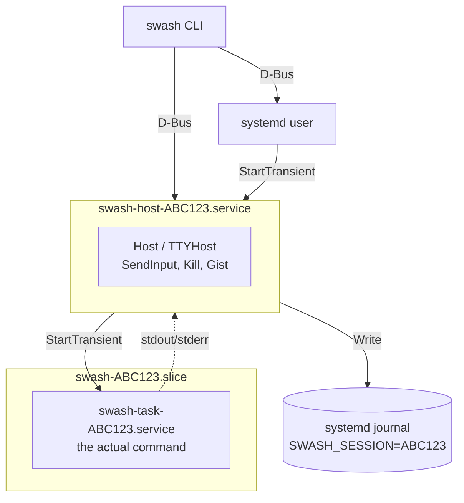

# swash

Process sessions over D-Bus with systemd integration.

swash runs commands as systemd transient units and captures their output to the
systemd journal. Each session gets a dedicated D-Bus service for control (send
input, kill process) and uses the journal for output streaming.

## Architecture



When you run `swash run echo hello`, the CLI asks systemd to start a transient
service called `swash-host-ABC123.service`. This host service owns a D-Bus name
(`sh.swa.Swash.ABC123`) and exposes methods for sending input, killing the
process, and querying status. The host then starts another transient unit,
`swash-task-ABC123.service`, which runs the actual command. Both units live
inside `swash-ABC123.slice` for resource grouping.

The host captures stdout and stderr from the task and writes each line to the
systemd journal with `SWASH_SESSION=ABC123`. This means output survives even if
the original client disconnects - you can reconnect later and query the journal
to see what happened.

## Usage

```bash
swash run echo "hello world"    # run command, show output, wait for exit
swash run -d 10s ./slow-script  # wait up to 10s, then detach if still running
swash start ./background-job    # start and detach immediately
swash                           # list running sessions
swash follow ABC123             # stream output until exit
swash send ABC123 "input"       # send to stdin
swash kill ABC123               # terminate
swash history                   # show past sessions from journal
```

`swash run` executes a command, streams its output, and waits for it to complete
(with a default 3-second timeout). If the command finishes in time, swash exits
with the command's exit code. If the timeout expires, it detaches and prints the
session ID so you can reconnect with `swash follow`.

`swash start` is equivalent to `swash run -d 0` - it starts the session and
returns immediately without waiting.

### TTY Mode

For interactive programs, swash can allocate a pseudo-terminal and emulate a
full terminal using libvterm. This handles colors, cursor movement, alternate
screen mode (used by vim, htop, etc.), and other terminal features correctly.

```bash
swash start --tty -- htop
swash start --tty --rows 40 --cols 120 -- vim file.txt
swash screen ABC123             # view current screen content
```

The `swash screen` command returns a snapshot of the terminal screen with ANSI
color codes preserved. Here's what it looks like with htop:

```
$ swash start --tty --rows 10 --cols 70 -- htop
XYZ789 started

$ swash screen XYZ789
    0[|||  4.6%]   4[||   2.0%]   8[||   3.3%]  12[||   2.0%]
    1[||   2.0%]   5[||   2.6%]   9[||   2.6%]  13[||   1.3%]
  Mem[|||||||||||||||||||||||||||||||||12.5G/62.6G]
  Swp[|                               520M/32.0G]

    PID USER       PRI  NI  VIRT   RES S  CPU% Command
1521271 mbrock      20   0 76.1G 4383M S  39.5 opencode
3814634 mbrock      20   0  855M  110M S   3.3 emacs
F1Help F2Setup F3Search F4Filter F5Tree F6SortBy F9Kill F10Quit
```

In TTY mode, output goes through libvterm before being logged. Lines are
captured as they scroll off the screen, and the final screen state is saved
to the journal when the process exits (as a `SWASH_EVENT=screen` entry).

### Tags and Protocols

You can attach custom metadata to sessions using tags, which become journal
fields:

```bash
swash run -t PROJECT=myapp -t ENV=staging -- ./deploy.sh
```

The `--protocol` flag controls how stdout is parsed. The default `shell`
protocol treats each line as a separate journal entry. The `sse` protocol
parses Server-Sent Events format, extracting the content from `data:` lines.

## Components

The CLI (`cmd/swash`) is the main entry point. It talks to systemd over D-Bus
to start sessions and connects to running host services to send input or query
status.

The core library (`internal/swash`) contains the session host implementations.
`Host` handles simple pipe-based I/O, while `TTYHost` adds pseudo-terminal
allocation and libvterm integration. Both implement the same D-Bus interface,
so the CLI doesn't need to know which mode a session is using.

The vterm package (`pkg/vterm`) provides Go bindings to libvterm. It tracks
screen state, handles scrollback callbacks, and can render the screen back to
ANSI escape sequences for the `swash screen` command.

For testing without a real systemd, `cmd/mini-systemd` implements enough of the
systemd D-Bus interface to run sessions. It also implements the native journal
socket protocol, using `pkg/journalfile` to write actual journal files that
journalctl can read. This lets the integration tests run in isolation without
root privileges.

## Building

```bash
go build ./cmd/swash/
./test/integration.sh           # runs against real systemd, then mini-systemd
./test/integration.sh --real    # runs against real systemd only
./test/integration.sh --mini    # runs against mini-systemd only
```

You'll need Go 1.23+, a C compiler (for libvterm via cgo), and the systemd
headers vendored in `cvendor/`.

## Journal Integration

swash writes structured fields to the journal, making it easy to query session
output:

```bash
journalctl --user SWASH_SESSION=ABC123          # all output from a session
journalctl --user SWASH_SESSION=ABC123 -o cat   # just the message text
journalctl --user SWASH_EVENT=exited            # all exit events
```

The `SWASH_SESSION` field identifies the session. `SWASH_EVENT` marks lifecycle
events (`started`, `exited`, `screen`). Regular output lines include `FD` (1 for
stdout, 2 for stderr) and `MESSAGE` (the actual text).

## Design Rationale

swash uses systemd transient units because systemd already solves process
lifecycle management well. It handles starting, stopping, and killing processes,
isolates resources via cgroups, cleans up automatically on exit, and integrates
with standard tooling. There's no need to reimplement any of that.

Each session gets its own D-Bus service (the host) so that clients can
disconnect and reconnect without losing the session. The D-Bus name provides
stable addressing - you can always reach session ABC123 at `sh.swa.Swash.ABC123`
regardless of PIDs or transient state. D-Bus method calls are a natural fit for
operations like "send this input" or "kill this process."

Output goes to the systemd journal rather than being held in memory or written
to files. The journal provides structured fields, efficient queries, automatic
rotation, and persistence across restarts. When you run `swash follow`, it's
just tailing the journal with a filter on `SWASH_SESSION`.

TTY mode uses libvterm because terminal emulation is surprisingly complex.
Regex-based approaches break on edge cases; libvterm implements a proper state
machine that handles all the escape sequences correctly. It also provides
scrollback callbacks, which is how swash captures output as it scrolls off the
screen rather than trying to diff screen states.
